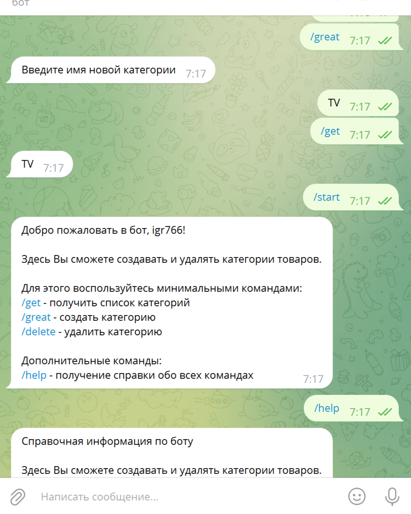

<h1>Телеграмм бот сервиса категорий</h1>

## Описание
Версия программы: 0.0.1

Фрагмент работы: 

## Реализованный функционал

- Сформирован перечень команд - создание, получение списка, удаление, переход по списку.
- категории формируются в виде модели - дерево.
- учтена позиция каждого пользователя

## Запуск

- Скачиваем весь проект
- Запускаем Docker
- В корне проекта есть файл docker-compose.yaml .
- Запускаем его командой docker compose up
- После запуска чат будет доступен по порту 8085 http://localhost:8081.

## Используемые технологии

- Java 17
- Spring Boot 3.1.4
- Liombok

## Автор проекта

- <a  href="https://github.com/igr76">Грицук Игорь</a>

